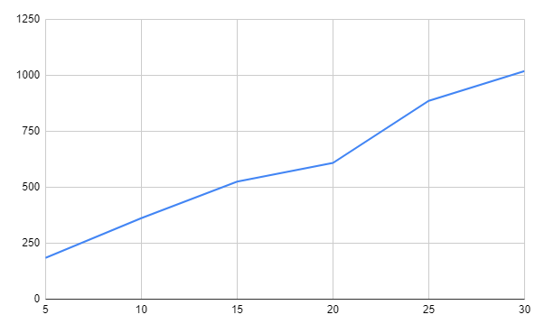
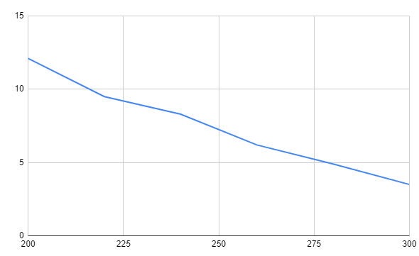
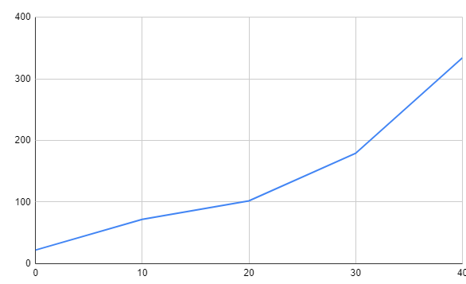

## Комп'ютерні системи імітаційного моделювання
## СПм-22-5, **Шевчук Євген Вадимович**
### Лабораторна робота №**1**. Опис імітаційних моделей та проведення обчислювальних експериментів

 

### Варіант 13, модель у середовищі NetLogo:
[Fruit Wars](https://www.netlogoweb.org/launch#http://www.netlogoweb.org/assets/modelslib/Sample%20Models/Social%20Science/Economics/Fruit%20Wars.nlogo)

 

### Вербальний опис моделі:
Модель Fruit Wars має на меті продемонструвати, як економічне середовище з ненульовою сумою може заохочувати співпрацю та перешкоджати насильству. Здобувачі корму блукають по карті в пошуках плодових чагарників. Коли вони прибувають до плодового куща, вони отримують енергію шляхом пошуку їжі, доки плодовий кущ не вичерпає ресурси. Ці здобувачі розмножуються та передають свої характеристики нащадкам після збору певної кількості енергії. Вони також приймають рішення на основі спадкових параметрів щодо того, як взаємодіяти з іншими здобувачами, які шукають їжу. Здобувачі їжі можуть співпрацювати, погрожувати, воювати чи тікати за різних обставин.

У моделі здобувачі можуть або співпрацювати, або боротися на основі спадкових атрибутів агресії. Параметр бонус-співпраці у моделі контролює, наскільки корисною є співпраця з точки зору пошуку їжі, тому слід очікувати, що еволюційна рівновага системи рухається в бік збирачів з менш жорстокими тенденціями, коли модель запускається з вищими налаштуваннями бонусу-співпраці.

### Початкові Параметри
- **initial-fruit-bushes** визначає початкову кількість плодових кущів
- **initial-foragers** визначає початкову кількість здобувачів їжі

### Параметри візуалізації
- **show-energy** відображати кількість енергії кожного збирача
- **visualisation** змінює тональність кольору агента в залежності від значення вибранного параметра, чим світліший тон кольору тим вище значення параметру

### Керуючі параметри:
- **ticks-to-flee** кількість ходів пересування збирача в випадкову сторону перед тим як він почне шукати кущі
- **rate-of-mutation** вірогідність зміни геному і передачі його до потомства
- **collaboration-bonus** бонус поживності одного куща для декількох збирачів
- **max-age** максимальна кількість ходів яку здобувач може прожити
- **bush-grow-chance** визначає шанс на появу нового плодового куща в кожний хід

### Внутрішні параметри:

- **speed** швидкість руху збирача
- **proactive-aggression** ймовірність захисту
- **reactive-aggression** ймовірність загрози
- **energy** метаболічна енергія збирача
- **genome** список що кодує успадковані параметри збирача
- **foraging** чи збирає збирач зараз фрукти
- **fleeing** чи збирач втікає
- **fleeing-turns** кількість ходів для втікання
- **age** вік збирача в ходах
- **strength** сила для боротьби
- **intelligence** інтеллект для группового збирання
- **amount** кількість енергії в кущі

### Показники роботи системи:
- загальна кількість збирачив
- середня кількість збирачів
- швидкість збирання
- швидкість змін сили, інтелекту і швидкості збирачів
- швидкість збирання
- відсоток вбивств від загальної кількості смертей
- відсоток смертей від голоду від загальної кількості смертей
- відсоток смертей від старості від загальної кількості смертей
- реактивна/проактивна агрессія

### Примітки:
При налаштуваннях керуючих параметрів за замовчуванням, автомобілі уповільнюються набагато швидше, ніж прискорюються.

### Недоліки моделі:

- генетика дуже проста та не відображає жодної залежності від дій збирачів
- надто маленьке різноманіття ресурсів, є тільки кущі, можно додати звірів які зможуть рухатися або інші кущі і дерева з іншими параметрами
- початковий рівень енергії має залежати від генетики, а не бути дефолтним стартовим значенням

## Обчислювальні експерименти

### 1. Вплив шансу появи куща на середню кількість населення

Досліджується, як зміна шансу росту нових фруктових кущів впливає на середню популяцію збирачів на 2000-му такті. Експерименти проводяться для значень максимального віку від 5 до 30, з кроком 5.

Інші керуючі параметри залишаються за замовчуванням:

initial-fruit-bushes: 40. initial-foragers: 40. ticks-to-flee: 49. rate-of-mutation: 1. collaboration-bonus: 5. max-age: 500.

<table>
<thead>
<tr><th>Шанс появи куща</th><th>Середнє населення</th></tr>
</thead>
<tbody>
<tr><td>5</td><td>0,47</td></tr>
<tr><td>10</td><td>0,38</td></tr>
<tr><td>15</td><td>0,46</td></tr>
<tr><td>20</td><td>0,44</td></tr>
<tr><td>25</td><td>0,30</td></tr>
<tr><td>30</td><td>0,14</td></tr>
</tbody>
</table>

Графік наочно показує пряму залежність збільшення средньої популяції від шансу появи кущів

### 2. Вплив максимального віку на смертність

Досліджується, як зміна максимально віку вплине на % смертей від старотсі на 2000 такті. Експерименти проводяться для значень шансу від 200 до 300, з кроком 20.

Інші керуючі параметри залишаються за замовчуванням:

initial-fruit-bushes: 40. initial-foragers: 40. ticks-to-flee: 49. rate-of-mutation: 1. collaboration-bonus: 5. bush-growth-chance: 6.

<table>
<thead>
<tr><th>Шанс появи куща</th><th>Середнє населення</th></tr>
</thead>
<tbody>
<tr><td>200</td><td>12,1</td></tr>
<tr><td>220</td><td>9,5</td></tr>
<tr><td>240</td><td>8,3</td></tr>
<tr><td>260</td><td>6,2</td></tr>
<tr><td>280</td><td>4,9</td></tr>
<tr><td>300</td><td>3,5</td></tr>
</tbody>
</table>

Графік наочно показує пряму залежність зменшення смертності від старості при збільшенні максимального віку.

### 3. Вплив початкової кількості кущів на показники населення

Досліджується, як зміна кількості початкових фруктових кущів впливає на пікові значення кількості збирачів на 200-му такті. Експерименти проводяться зі зміною кількості фруктових кущів від 0 до 40 з кроком 10.

Інші керуючі параметри залишаються за замовчуванням:

initial-foragers: 40. ticks-to-flee: 49. rate-of-mutation: 1. collaboration-bonus: 5. max-age: 500. bush-growth-chance: 6.

<table>
<thead>
<tr><th>Початков кількість кущів</th><th>Населення</th></tr>
</thead>
<tbody>
<tr><td>0</td><td>22</td></tr>
<tr><td>10</td><td>72</td></tr>
<tr><td>20</td><td>102</td></tr>
<tr><td>30</td><td>179</td></tr>
<tr><td>40</td><td>334</td></tr>
</tbody>
</table>

Графік наочно показує пряму залежність збільшення пікового населення від початковї кількість кущів.